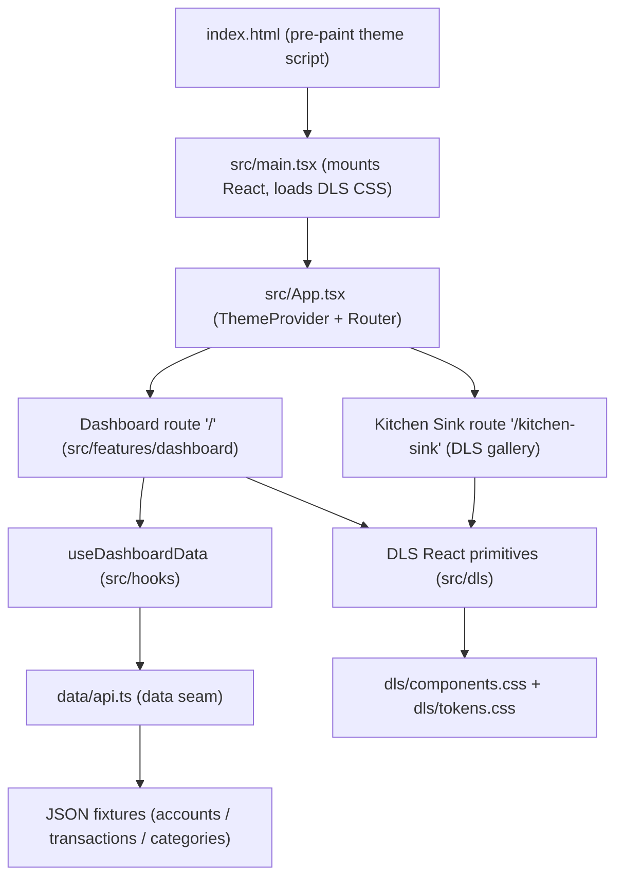

<!-- generated-by: spec-doc-writer -->
# Architecture

## System overview

Meridian is a single-page retail-bank customer dashboard built with React 18,
TypeScript, and Vite. It renders a customer's accounts, recent transactions,
spending by category, and a savings goal from a typed data layer, with light and
dark themes. The application is a static front end: it takes account,
transaction, and category data as input (today from local JSON fixtures behind a
mock API) and produces a responsive dashboard UI as output.

The codebase is organized around **three contracts**, each backed by its own
directory. This is the defining structure of the project:

- **Design contract (`dls/`)** — the single source of truth for every visual
  value. CSS custom properties in `dls/tokens.css` define colour, spacing,
  radius, type, shadow, and motion; `mrdn-` component classes in
  `dls/components.css` compose those tokens into reusable UI primitives. React
  components never write raw colours or pixel values; they resolve back to these
  tokens.
- **Data contract (`data/`)** — a single, typed seam between the app and its
  data. `data/api.ts` exposes `getAccounts`, `getTransactions`, and
  `getCategories`, returning the shapes declared in `data/types.ts`.
- **Behaviour contract (`tests/`)** — Playwright checks in
  `tests/responsive.spec.js` that assert the dashboard renders and reflows
  correctly at mobile, tablet, and desktop widths.

The rest of the app (`src/`) is a thin composition layer over these three
contracts.

## Component diagram



Data flows top to bottom; an arrow `A --> B` means A depends on or renders B.
Leaf-level utilities (`src/lib/format.ts`, `src/lib/motion.ts`) and the app-shell
chrome (`src/components/AppBar.tsx`, `ThemeToggle`, `icons`) are omitted from the
diagram for clarity.

## Data flow

A typical page load moves through the app as follows:

1. **Pre-paint theme** — `index.html` runs a small inline script that reads the
   saved theme from `localStorage` (or the OS preference) and sets
   `data-theme="light|dark"` on `<html>` before React mounts, avoiding a flash of
   the wrong theme.
2. **Mount** — `src/main.tsx` imports the design contract first
   (`dls/tokens.css`, then `dls/components.css`), then the app-shell styles
   (`src/styles/app.css`), and renders `<App />` into `#root`.
3. **Shell + routing** — `src/App.tsx` wraps everything in `ThemeProvider` and a
   `BrowserRouter`. Two routes are defined: `/` renders the dashboard, and
   `/kitchen-sink` renders the live DLS gallery. Each route mounts a shared
   `AppBar`.
4. **Data fetch** — `src/features/dashboard/Dashboard.tsx` calls the
   `useDashboardData` hook. On mount, the hook fires
   `getAccounts()`, `getTransactions()`, and `getCategories()` in parallel via
   `Promise.all` and exposes `{ accounts, transactions, categories, loading,
   error }`.
5. **The data seam** — `data/api.ts` is the one place the app talks to its data.
   Each call reads a local JSON fixture behind a small simulated latency and
   returns it typed to the contract in `data/types.ts`. Swapping the fixtures for
   a live `fetch` against a real backend is a change confined to this one file,
   because the response *shape* is the contract.
6. **Render** — `Dashboard.tsx` shows skeleton placeholders while `loading` is
   true, an error card if `error` is set, and otherwise lays out the feature
   widgets (`Balances`, `RecentActivity`, `QuickActions`, `SpendByCategory`,
   `SavingsGoal`) in a 12-column DLS grid. Each widget derives its own view from
   the fetched data (for example, `SpendByCategory` groups spending totals for
   the latest month) and renders using DLS primitives.
7. **Formatting** — money is formatted through `formatSGD` in `data/api.ts`
   (SGD, `en-SG`, minor units); dates and monograms use helpers in
   `src/lib/format.ts`.

## Key abstractions

| Abstraction | Location | Description |
| --- | --- | --- |
| DLS React primitives | `src/dls/primitives.tsx` | Thin, typed wrappers (`Card`, `Stat`, `Amount`, `Button`, `Pill`, `Chip`, `Row`, `Progress`, `Skeleton`, `Avatar`) that emit the exact `mrdn-` markup and add no styling of their own. |
| DLS layout primitives | `src/dls/layout.tsx` | `Grid`, `Col`, `Stack`, `Cluster`, and `SectionTitle` — the `mrdn-` grid and flow helpers. Responsive column behaviour lives in the CSS. |
| Data seam | `data/api.ts` | `getAccounts` / `getTransactions` / `getCategories` plus the `formatSGD` money helper; the single boundary between the app and its data. |
| Data types | `data/types.ts` | TypeScript shapes (`Account`, `Transaction`, `Category`, `SavingsGoal`) that mirror the data contract; a live backend must return exactly these fields. |
| `useDashboardData` hook | `src/hooks/useDashboardData.ts` | Loads all three endpoints once in parallel and returns loading/error state alongside the data. |
| `ThemeProvider` | `src/theme/ThemeProvider.tsx` | Decides which theme is active, reflects it onto `<html>` as `data-theme`, persists the user's choice, and follows the OS setting until the user chooses explicitly. Applies no styles of its own. |
| Design tokens + components | `dls/tokens.css`, `dls/components.css` | The design source of truth: CSS custom properties and the `mrdn-` component classes composed from them. |
| Behaviour contract | `tests/responsive.spec.js`, `playwright.config.js` | Playwright suite asserting the dashboard renders and reflows across mobile (390px), tablet (768px), and desktop (1280px) viewports. |

**Theming.** Dark mode is expressed purely as `[data-theme="dark"]` token
overrides in `dls/tokens.css`. Components stay theme-agnostic by reading tokens
(and `currentColor`) rather than hard-coded colours, so a single set of token
overrides restyles the whole app.

**Responsiveness.** The `mrdn-grid` is a 12-column CSS grid that collapses to 6
columns at `≤900px` and a single column at `≤640px`. Because the reflow lives
entirely in `dls/components.css`, the React layout primitives stay declarative
and the behaviour contract verifies the result.

## Directory structure rationale

The tree separates the three contracts from the composition layer that uses
them:

```text
.
├── index.html          Entry document; sets initial theme before first paint
├── src/                Application composition layer
│   ├── main.tsx        Mounts React; imports DLS CSS in order
│   ├── App.tsx         Theme provider + router (routes: / and /kitchen-sink)
│   ├── dls/            React wrappers that emit mrdn- markup (primitives, layout)
│   ├── components/     App-shell chrome: AppBar, ThemeToggle, icons
│   ├── features/       Route-level UI
│   │   ├── dashboard/  The dashboard widgets (Balances, RecentActivity, etc.)
│   │   └── kitchen-sink/  Live gallery of every DLS token and component
│   ├── hooks/          useDashboardData: parallel load of the data endpoints
│   ├── lib/            Small presentational helpers (date formatting, motion)
│   ├── theme/          ThemeProvider and useTheme
│   └── styles/         app.css: page chrome and layout only (all values are tokens)
├── data/               Data contract: api.ts seam, types.ts, JSON fixtures
├── dls/                Design contract: tokens.css, components.css, DLS-RULES.md
└── tests/              Behaviour contract: Playwright responsive suite
```

- **`dls/` is intentionally separate from `src/`** so the design decisions
  (tokens and `mrdn-` components) are a self-contained contract, independent of
  any single React component that consumes them.
- **`data/` is a sibling of `src/`** to make the data seam explicit: everything
  the app knows about its data goes through `data/api.ts` and `data/types.ts`.
- **`src/dls/` wraps, never restyles.** These React primitives exist only to give
  a typed, composable way to stamp out the `mrdn-` markup, keeping the CSS layer
  as the single source of truth for appearance.
- **`src/features/` is split by route.** `dashboard/` holds the product UI;
  `kitchen-sink/` is a reference gallery that renders every DLS token and
  component live in both themes, reading computed token values at runtime.
- **`src/components/`, `src/hooks/`, `src/lib/`, `src/theme/`, `src/styles/`**
  hold the app-shell chrome, data loading, presentational helpers, theme control,
  and page layout respectively — the plumbing that assembles the three contracts
  into a running app.
